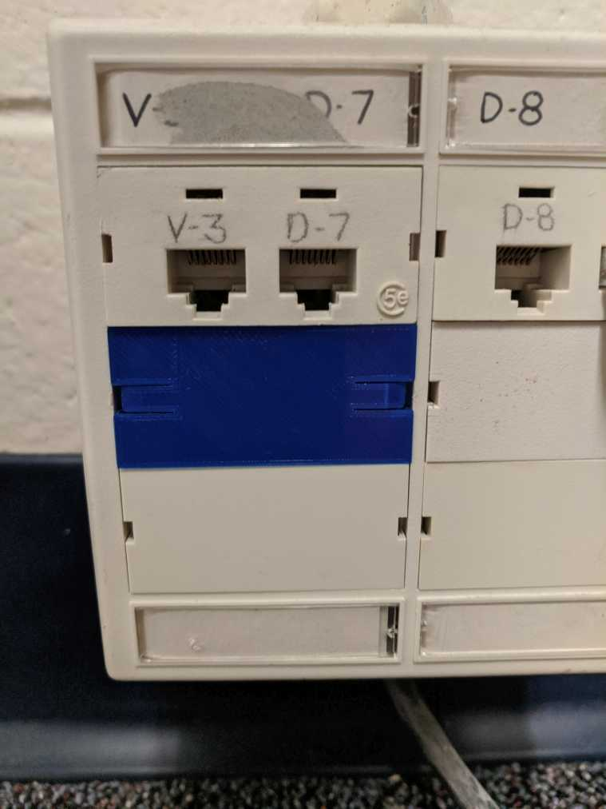

# Ethernet Jack Blank Plate

Ran out of blank plates for the Ethernet jacks in the office, tried my hand at using OpenSCAD to make a basic replacement. Tried to make is as fast to print as possible as this is just a cosmetic cover and doesn't need to sturdy.

Not sure the proper name; the ones I had been using were made by ModTap. 

